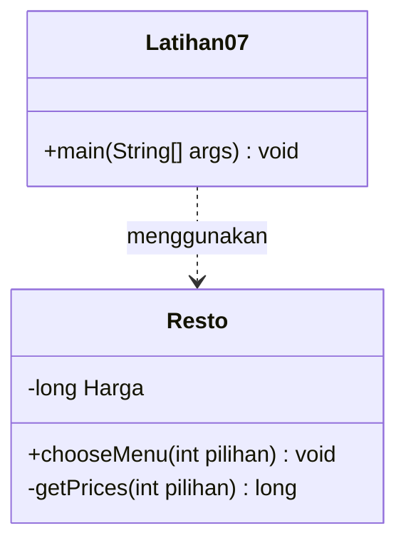

# Latihan 08 - Class Diagram

```mermaid
classDiagram
    class Resto {
        -long Harga
        +chooseMenu(int pilihan) void
        -getPrices(int pilihan) long
    }

    class Latihan07 {
        +main(String[] args) void
    }

    Latihan07 ..> Resto : menggunakan
```

