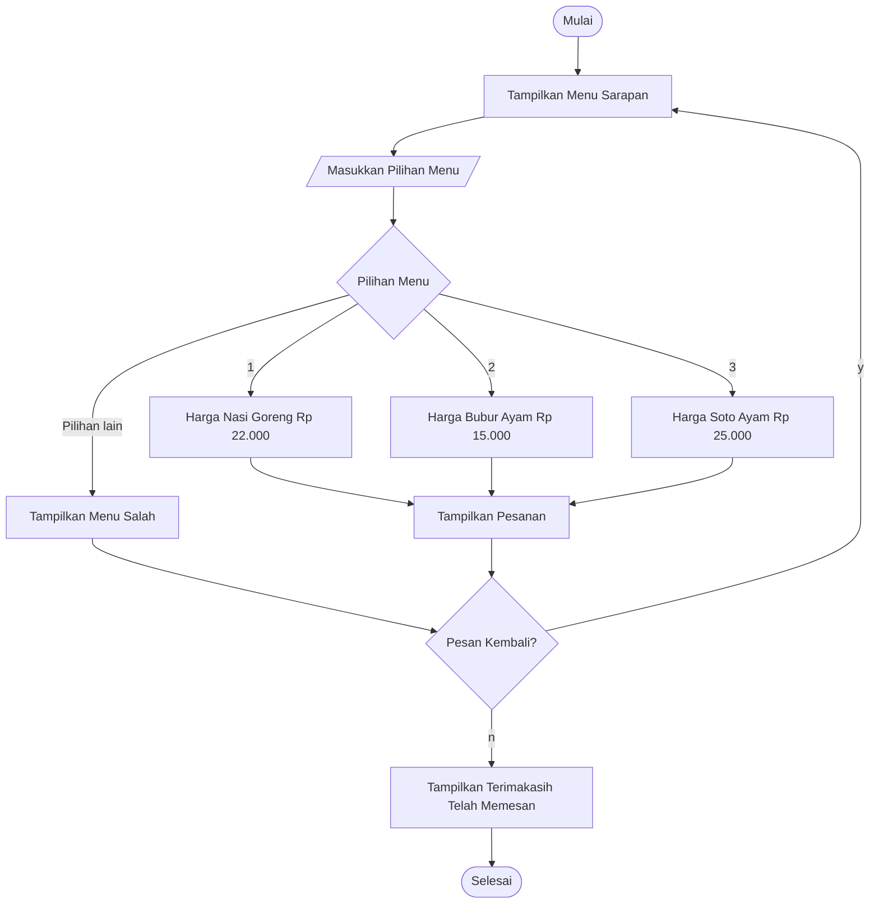

# Latihan 09 - Activity Diagram

```mermaid
flowchart TD
    A([Mulai]) --> B[Tampilkan Menu Sarapan]
    B --> C[/Masukkan Pilihan Menu/]
    C --> D{Pilihan Menu}

    D -->|1| E[Harga Nasi Goreng Rp 22.000]
    D -->|2| F[Harga Bubur Ayam Rp 15.000]
    D -->|3| G[Harga Soto Ayam Rp 25.000]
    D -->|Pilihan lain| H[Tampilkan Menu Salah]

    E --> I[Tampilkan Pesanan]
    F --> I
    G --> I
    H --> J{Pesan Kembali?}
    I --> J

    J -->|y| B
    J -->|n| K[Tampilkan Terimakasih Telah Memesan]
    K --> L([Selesai])
```
